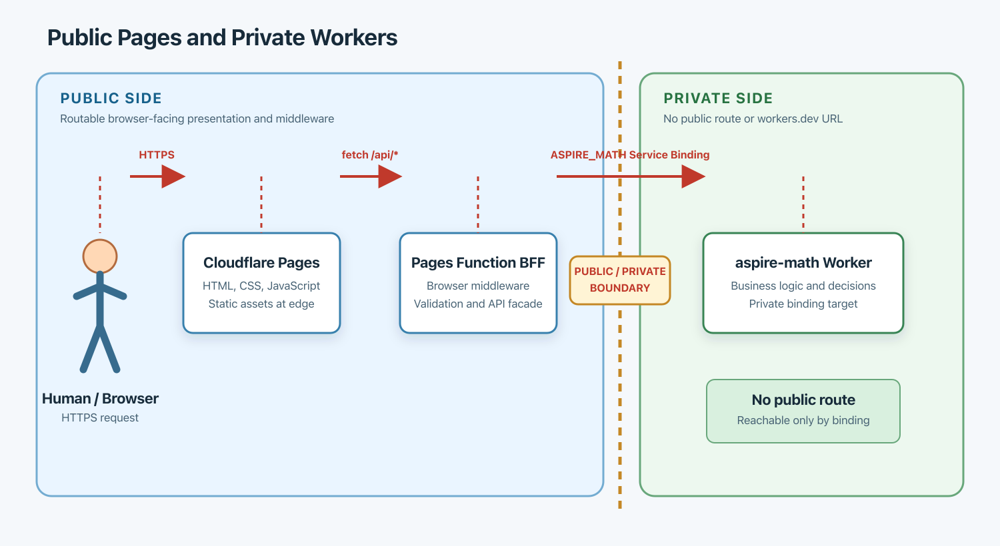

# Public Pages and Private Workers

## Preamble

Cloudflare is serverless. At least on the free tier, it does not provide conventional VPC or network-topology controls, so many tutorials expose Workers through public routes.

This paper presents an alternative: keep presentation on public Pages and backend capabilities in Workers with no public route, reachable only through Service Bindings.

The frontend can use an identity provider such as [Clerk](https://clerk.com/) or [Auth0](https://auth0.com/), keeping customer authentication separate from private service connectivity.

## Intent

Use public Pages for presentation and private Workers for business capabilities. Private Workers have no public `workers.dev` hostname or route; their only entry point is a Service Binding from a trusted caller.

This separates responsibilities:

- Pages owns presentation: HTML, JavaScript, CSS, images, and browser delivery.
- Workers own decisions: business logic, calculations, database access, secrets, validation, and integrations.

## Topology



[Open the architecture diagram as a PNG](architecture.png)


The private Worker is analogous to a service in a private subnet. This is an architectural analogy, not a literal private network: the Worker is isolated by the absence of public ingress and by Service Binding access control.

## Request Flow

1. A browser requests the static Pages site.
2. Pages returns the frontend assets from the edge.
3. The frontend calls the browser-facing BFF endpoint when it needs data or a business operation.
4. The BFF invokes the private Worker through a Service Binding.
5. The private Worker performs the calculation or business decision.
6. The result travels back through the BFF to the browser.

The browser never calls `aspire-math` directly and never needs to know its internal Worker identity.

## Ingress Rules

The private Worker must remain configured with:

See the [aspire-math Worker configuration](workers/aspire-math/wrangler.toml).

- `workers_dev = false`
- no `routes` entry
- no public custom domain
- no direct browser-facing endpoint

Deployment is still possible without a route. Deployment publishes the Worker version, but it does not publish a public URL. The Worker is then available to configured Service Binding callers.

## Why Service Binding

A Service Binding is the connection between the Pages-side BFF and the private Worker. It provides:

- an explicit caller relationship
- Worker-to-Worker communication without public DNS
- no CORS requirement between the internal services
- a small and intentional trust boundary
- independent deployment of the Pages project and private Worker

The binding name is part of the caller's configuration. In this system the intended name is `ASPIRE_MATH` and it points to the Worker service `aspire-math`.

See the [Pages Service Binding configuration](pages/wrangler.toml).

## Tokens and JWTs

Service Bindings remove the need to expose the private Worker through a public route. They do not make application authorization unnecessary.

Use Service Bindings for network reachability and service identity. Use Service Tokens, JWTs, or application authentication when the business operation needs user identity, authorization, tenant isolation, auditing, or defense in depth.

These concerns are separate:

- No route: the private Worker has no public ingress.
- Service Binding: an allowed Worker can invoke it internally.
- JWT or service token: the caller or operation can be authenticated and authorized.
- WAF: public Pages traffic can be filtered, including geographic restrictions.
- Clerk/Auth0: public B2C users can sign in to the application.
- Access: optional protection for private tools, tunnels, and administration.

## Public B2C Boundary

For a public-facing application, customer authentication belongs at the application boundary, using Clerk, Auth0, or another application identity provider. Cloudflare Access is optional and should be reserved for private infrastructure or administration.

A public Pages site may use a WAF rule to allow only selected countries, such as India, before requests consume application resources. This is independent of the private Worker design.

## Important Limitation

A purely static browser page cannot call a private Service Binding directly. Service Bindings are available to Worker runtimes, not to browser JavaScript.

Therefore, one of these must exist between the browser and the private Worker:

- a Pages Function acting as a BFF
- a separate public BFF Worker
- a server-rendered or server-handled application endpoint

That browser-facing endpoint is publicly routable and must be protected with application authentication, rate limiting, validation, and WAF controls. The sensitive business Worker remains private behind it.

## Architectural Rule

> Keep presentation public and business capabilities private. Give the private Worker no public route. Connect it only through explicit Service Bindings. Put user authentication and public traffic controls at the browser-facing boundary.

## Current Aspire Shape

```text
worker_pages/
  pages/
    index.html
    functions/       browser-facing BFF functions
    wrangler.toml    Pages configuration

  workers/
    aspire-math/
      src/           private business Worker
      wrangler.toml  workers_dev = false
```

This allows the frontend and private business services to evolve and deploy independently while keeping the public/private boundary visible in the repository.
